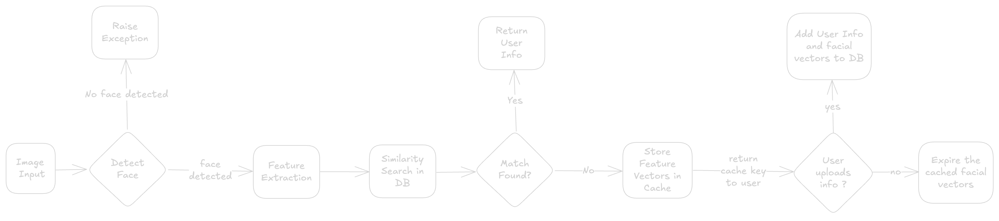
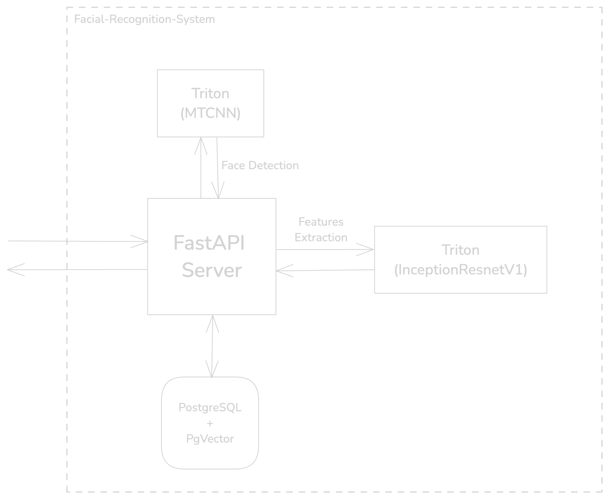

# FACE MATRIX BACKEND

# System overview

A backend system for facial recognition that detects faces, extracts features, matches them in a database, and supports user enrollment.

# System Requirements

## Functional Requirements

1. Accept an image as input.
2. Detect a face in the image.
3. Extract feature vectors using a pre-trained model.
4. Search for a similar face in the database.
5. Return user information if a match is found.
6. Handle user enrollment by storing vectors and details in the database.

## Non Functional Requirements

1. **Performance**: API response time < 1 second.
2. **Scalability**: Handle 10,000 faces with 1 reqs/sec.
3. **Availability**: 99.99% uptime for up to 5 reqs/sec.
4. **Maintainability**: Maintainability index ≥ 85 (≥ 20 by Visual Studio standards).

# Application Flow



1. **Image Input**: User uploads an image.
2. **Face Detection**: Detect a face in the image.
    - If no face is detected, raise an exception.
3. **Feature Extraction**: Extract facial features from the detected face.
4. **Similarity Search**: Perform a similarity search in the database for matching facial vectors.
    - If a match is found, return user information.
    - If no match is found:
        - Store the facial vectors in the cache.
        - Return a cache key to the user.
5. **User Uploads Info?**: Check if the user provides additional information.
    - If yes, add the user info and facial vectors to the database.
    - If no, expire the cached facial vectors.

# Architecture



# System Components

1. **Face Detection**:
    - **Model**: MTCNN
    - **Role**: Detects, crops and aligns faces for features extraction.
2. **Feature Extraction**:
    - **Model**: FaceNet (InceptionResNetV1 pre-trained on “vggface2” dataset)
    - **Role**: Generates 512-D vectors.
3. **Similarity Search**:
    - **Tech**: PostgreSQL with `pgvector`.
    - **Role**: Perform similarity lookups.
4. **Database**:
    - **Tech**: PostgreSQL.
    - **Role**: Persistent storage for user info and feature vectors, temporarily cache unmatched feature vectors.
5. **Model Inference Server**:
    - **Tech**: Nvidia’s Triton.
    - **Role**: Serves ML models and handles inference requests, through a client server architecture. Manages model execution on GPUs.

# Technical Specifications

## API Documentation

The  REST APIs will expose two key endpoints:

1. **Image Recognition API**: Responsible for recognising a user from their uploaded image.
2. **Add User API**: Will allow new users to add themselves in the system.

### Image Recognition API

- **API Endpoint**
    
    ```jsx
    POST /api/v1/recognise_user
    Content-Type: multipart/form-data
    ```
    
- **Request Parameters**
    
    **image** : The image file containing the face to be recognised.
    
    ```jsx
    {
      "image": [binary data]
    }
    ```
    
- **Response**
    
    The API will respond with a JSON object containing the following fields:
    
    - **status**: Indicates whether the recognition attempt was successful (`"success"` or `"error"`).
    - **message**: A message describing the result of the recognition attempt (e.g., "Match found", "No match found").
    - **user_info**: Contains user details if a match is found. If no match is found, this will be `null`.
    - **enrollmentKey**: (only if no match is found) Includes:
        - **req_id**: A unique identifier that the user can use later for enrollment without re-uploading the image.
        - **expiresAt**: The expiration time of the temporary data in the cache.
        - **metadata**: Information about the quality and confidence of the detected face in the image.
    
    **Example successful response:**
    
    ```json
    {
      "status": "success",
      "message": "Match found",
      "user_info": {
        "id": "12345",
        "name": "John Doe",
        "email": "john.doe@example.com"
      }
    }
    ```
    
    **Example response when no match is found:**
    
    ```json
    {
      "status": "failure",
      "message": "no_match",
      "req_id": "req-67890"
    }
    
    ```
    

### Add User API

- **API Endpoint**
    
    ```jsx
    POST /api/v1/add_user
    Content-Type: multipart/form-data
    ```
    
- **Request Parameters**
    
    The request should include the following parameters:
    
    - **name** (string, required): The user's full name.
    - **birthdate** (string, required): The user's birthdate in Date format.
    - **req_id** (string, optional): Key to the cached facial vectors.
    
    **Request Example (Using Cached Request ID for Enrollment):**
    
    ```json
    {
      "name": "John Doe",
      "birthdate": "2002-10-19",
      "req_id": "req-67890"
    }
    ```
    
- **Response**
    
    The API will respond with a JSON object containing the following fields:
    
    - **status**: Indicates whether the enrollment attempt was successful (`"success"` or `"error"`).
    - **message**: A descriptive message explaining the result (e.g., "User added successfully", "User already exists").
    - **user_id**: The unique identifier assigned to the new user, returned if the user is successfully enrolled.
    - **error_code**: Optional, included in case of errors.
    
    **Example Successful Response:**
    
    ```json
    {
      "status": "success",
      "message": "User added successfully",
      "user_id": "12345"
    }
    ```
    
    Example Error Response:
    
    ```json
    {
      "status": "error",
      "message": "User already exists with this email",
      "error_code": 404
    }
    ```
    

## Database Schema

### **Users Table**

```sql
CREATE TABLE users (
    id SERIAL PRIMARY KEY,                    
    name VARCHAR,               
    email VARCHAR(255) UNIQUE NOT NULL,       
    birthdate DATE NOT NULL,                  
    face_vector VECTOR(128) NOT NULL,       
```

### Cache Table

```sql
CREATE TABLE IF NOT EXISTS "vectors_cache" (
    timestamp timestamp NOT NULL DEFAULT NOW(),
    key VARCHAR PRIMARY KEY,
    face_vectors vector(512) NOT NULL
);
```

## Error Handling

Each service layer follows a standard approach to managing errors 

**Error Categories**

1. **Client Errors (4XX)**:
    - **400 - Bad Request**: Input validation failures. (**Face Not Detected, Similarity Threshold Not Met)**
    - **404 - Not Found**: Resource not found.
    - **409 - Conflict**: Duplicate entries.
2. **Server Errors (5XX)**:
    - **500 - Internal Server Error**: Generic server issues.
    - **503 - Service Unavailable**: When external dependencies are down.

**Error Response Structure**

All error responses are structured like this:

- `error_code`: error code as per the above categories.
- `message`:  error message.
- `requestId`: Unique identifier to trace the error to specific requests.

```json
{
  "status": "error",
  "error_code": 601,
  "message": "Face not detected in the image"
}
```

# Ideated Deployment Architecture


# **Performance Benchmarking**

## **Dataset**

- **Name**: Labeled Faces in the Wild (LFW)
- Link: [Dataset Link](https://www.kaggle.com/datasets/jessicali9530/lfw-dataset?select=people.csv)
- **Details**:
    - Total number of unique identities: 5,750+
    - Images per identity: Varies, with multiple images for some identities.

## **Benchmarking**

1. **False Rejection Rate (FRR)**:
    - **Objective**: Measure how often the system fails to recognise the correct match for a given identity.
    - **Setup**:
        - Extracted unique identities with more than one image.
        - Used the first image to create the database of embeddings.
        - Tested the second image of each identity for recognition.
2. **False Acceptance Rate (FAR)**:
    - **Objective**: Measure how often the system incorrectly matches an input image to a different identity.
    - **Setup**:
        - Divided the dataset into two halves.
        - Used the first half to populate the database of embeddings.
        - Tested the second half for recognition.

| **Metric** | **DB Size** | **Test data size** | **Errors** | **Rate(%)** |
| --- | --- | --- | --- | --- |
| FRR | 5650 | 1680 | 108 | 6.43 |
| FAR | 2796 | 3557 | 149 | 4.19 |

# Load Testing Summary

## Test Configuration

The load test was conducted using the following parameters:

### **Load Simulation**

- Execution using the `constant-vus` executor.

### **Scenarios**

- **1st stage**: 4 VUs (duration: 5 minutes)
- **2nd stage**: 8 VUs (duration: 5 minutes)
- **3rd stage**: 12 VUs (duration: 5 minutes)

### **Thresholds**

- 95% of reqs must have a response time < **3000 ms**.
- Failure rate must be < **5%**.

### Test Data

- **Dataset**: [Link](https://www.kaggle.com/datasets/jessicali9530/lfw-dataset?select=people.csv)
- **Requests**: Each request contained a randomly selected image from the enrolled dataset.

### Results

#### HTTP Performance Summary

| Metric | Value |
|--------|-------|
| Max Throughput | 5.44 req/s |
| HTTP Failures | 0.0120 req/s |
| Avg. Response Time | 1.46 s |
| 95% Response Time | 2.86 s |
| Total Requests | 4,968 |
| Failed Requests | 11 (0%) |
| Unique URLs Tested | 6 |

#### Top Slowest URLs (sorted by P95 response time)

| Endpoint | Scenario | Method | Status | Count | Avg | P95 | Max |
|----------|----------|--------|--------|-------|-----|-----|-----|
| /api/recognise_user | scenario_12_users | POST | 200 | 1.72K | 2.11s | 3.44s | 5.80s |
| /api/recognise_user | scenario_12_users | POST | 400 | 4 | 1.66s | 2.63s | 2.76s |
| /api/recognise_user | scenario_8_users | POST | 200 | 1.65K | 1.46s | 2.59s | 4.06s |
| /api/recognise_user | scenario_8_users | POST | 400 | 3 | 1.62s | 2.16s | 2.26s |
| /api/recognise_user | scenario_4_users | POST | 400 | 4 | 1.09s | 2.03s | 2.13s |
| /api/recognise_user | scenario_4_users | POST | 200 | 1.59K | 753ms | 1.33s | 2.73s |

#### Final Evaluation

A total of 9,936 checks were evaluated with 22 failures, resulting in a 99.8% overall success rate.

| Check Name | Success Rate | Success Count | Fail Count |
|------------|--------------|--------------|------------|
| status is 200 (scenario_8_users) | 99.8% | 1,649 | 3 |
| response matches schema (scenario_8_users) | 99.8% | 1,649 | 3 |
| status is 200 (scenario_12_users) | 99.8% | 1,715 | 4 |
| status is 200 (scenario_4_users) | 99.7% | 1,593 | 4 |
| response matches schema (scenario_4_users) | 99.7% | 1,593 | 4 |
| response matches schema (scenario_12_users) | 99.8% | 1,715 | 4 |

#### Thresholds

All performance expectations were met, with no defined thresholds being exceeded:
- http_req_duration: p(95) < 3000ms ✓
- http_req_failed: rate < 0.05 ✓

### Performance by Scenario

#### Response Time Peak
- Maximum response time: 6s (at 12 VUs)
- Average response time at peak: 3s
- 95% of requests at peak: < 5s

#### Throughput
- Overall average: 5.5 req/s
- Peak: 7.3 req/s (at 12 VUs)

#### Bandwidth
- Data sent peak: 66.5 KB/s (at 12 VUs)
- Data received peak: 1.79 KB/s (at 12 VUs)
- Total data sent: 44.1 MB
- Total data received: 1.18 MB

## Resource Utilisation

### **CPU Usage**

- Started at ~250% and stayed constant about ~300% as the load reached it’s peak.

### **Memory Usage**

- Started at ~150 MB and peaked at ~300 MB.

